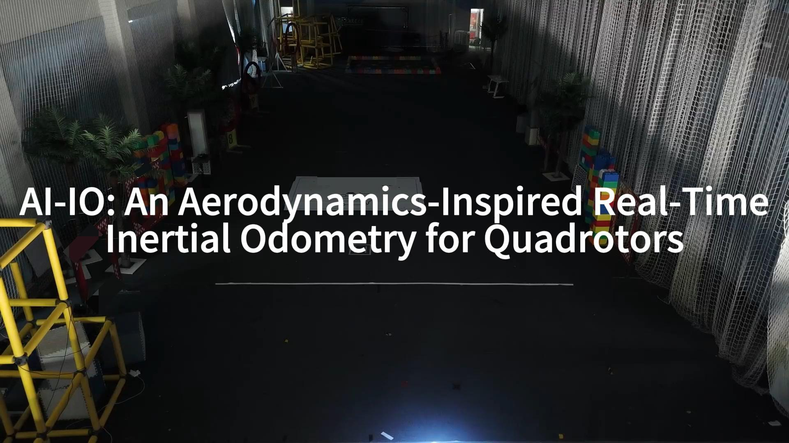

# AI-IO: An Aerodynamics-Inspired Real-Time Inertial Odometry for Quadrotors



## Dataset and Environment

### Dataset Preparation

#### our dataset

[here](https://github.com/Csfalpha/AI-IO/releases/download/v1.0/AI-IO_dataset.tar.gz)

#### DIDO dataset

[here](https://github.com/zhangkunyi/DIDO)

### Environment Build

See `requirements.txt` for environment requirements.

## Quick Start: Run with Default Configurations

### Training

```
python src/main_learning.py \
	--data_config=config/our2.conf \
    --out_dir=results \
    --dataset=our2 \
    --mode=train \
    --imu_freq=100 \
    --sampling_freq=100 \
    --window_time=1
```

For the AI-IO dataset, our pre-trained weights is [here](https://github.com/Csfalpha/AI-IO/releases/download/dataset-v1.0/checkpoint_open.pt)

### Testing

```
python src/main_learning.py \
	--data_config=config/our2.conf \
    --out_dir=results \
    --dataset=our2 \
    --mode=test \
    --imu_freq=100 \
    --sampling_freq=100 \
    --window_time=1 \
    --model_fn=checkpoint_yours.pt \
    --show_plots
```


### EKF

run EKF

```
python src/main_filter.py \
	--data_config=config/our2.conf \
	--out_dir=results \
	--dataset=our2 \
	--checkpoint_fn=checkpoint_yours.pt \
	--model_param_fn=model_net_parameters.json
```

plot EKF ruslts

```
python src/filter/python/plot_filter_output.py \
	--data_config=config/our2.conf \
	--result_dir=results \
	--dataset=our2
```


## Credits

This repo uses some external open-source code:

* [IMO](https://github.com/uzh-rpg/learned_inertial_model_odometry)

Refer to each open-source code for the corresponding license.

If you note that we missed the information about the use of any other open-source code, please open an issue.
